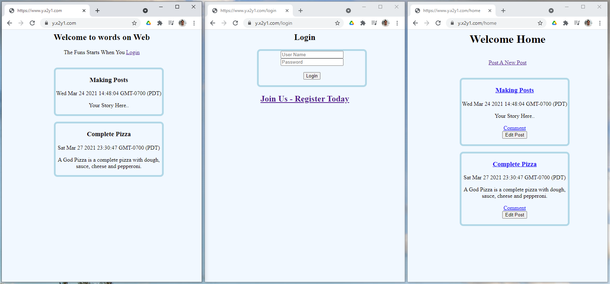
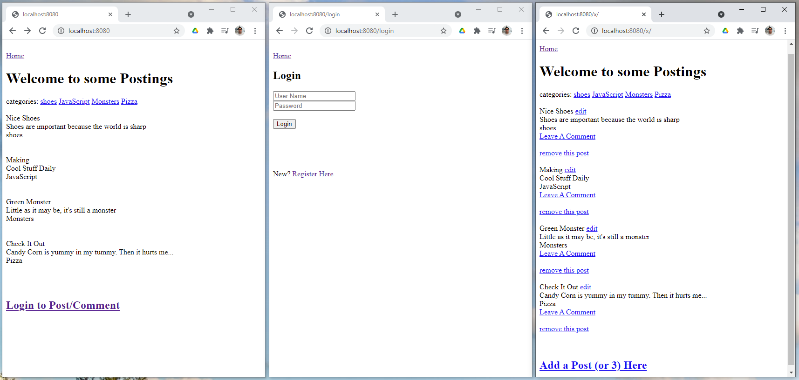

# Week8 - Full Stack - NodeJS - External Database

## Blog
This week we incorperated an external database to store our users, passwords, blog posts, blog comments and dates associated with thier creation/edit. We did the same project twice because the implentaion of PG Promise was different enough from Sequalize that making the project twice was better then trying to change one to the other. We were introduced to ElephantSQL for our SQL hosting database, and I was able to load it on my webhost, so check it out live at y.x2y1.com You can register or use 'red' as both username and password.

## Blog2
As mentioned above this is simply the same blog application but using Sequalize with NodeJS to interact with the SQL database.

In this one it includes a category for the post and at the top I just looped through the catagories and listed them, so if there was more then one it would display twice.

